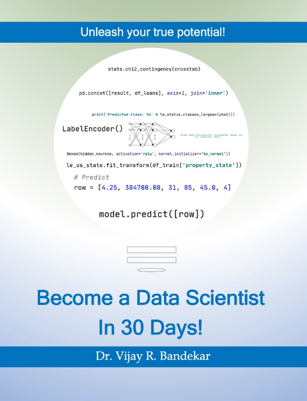

# "Become a Data Scientist in 30 Days" companion materials

Python code developed for the book "Become a Data Scientist in 30 Days"!
This book is here to help you get your job done.

The book is available for preview on [Amazon](https://read.amazon.com/kp/embed?asin=B08B772ZQD&preview=newtab&linkCode=kpe&ref_=cm_sw_r_kb_dp_k6GoFbXESJCQ9).

## License

In general, if example code is offered with this book, you may use it in your programs and documentation. You do not
need to contact us for permission unless you’re reproducing a significant portion of
the code.

For example, writing a program that uses several chunks of code from this
book does not require permission. Selling or distributing a CD-ROM of examples
from Kindle Direct Publishing does require permission. Answering a question by citing this
book and quoting example code, does not require permission.

Incorporating a significant amount of example code from this book into your product’s documentation does
require permission.

## Attribution

We appreciate, but do not require, attribution. An attribution usually includes the
title, author, publisher, and ISBN. For example:

Become a Data Scientist in 30 Days by Dr. Vijay R. Bandekar. Copyright 2020 InteliOps, Inc.

If you feel your use of code examples falls outside fair use or the permission given
above, feel free to contact the author at [vijay@inteliops.com](vijay@inteliops.com)
or [taoyilee@protonmail.com](taoyilee@protonmail.com).

The Python code is provided for Chapter 2, Chapter 4 and Chapter 5.
